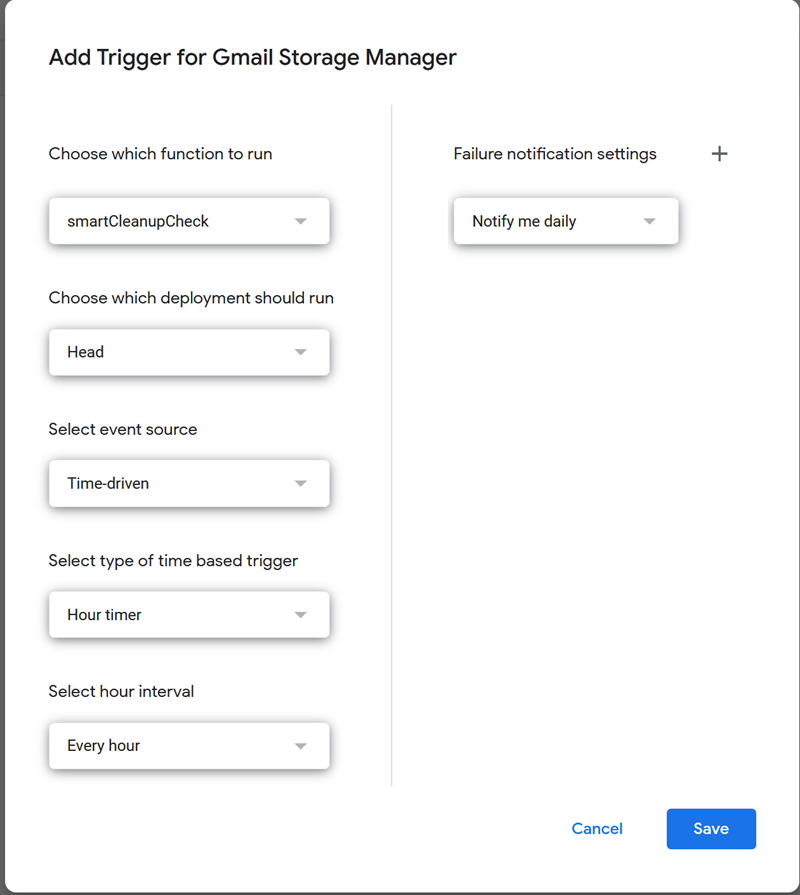
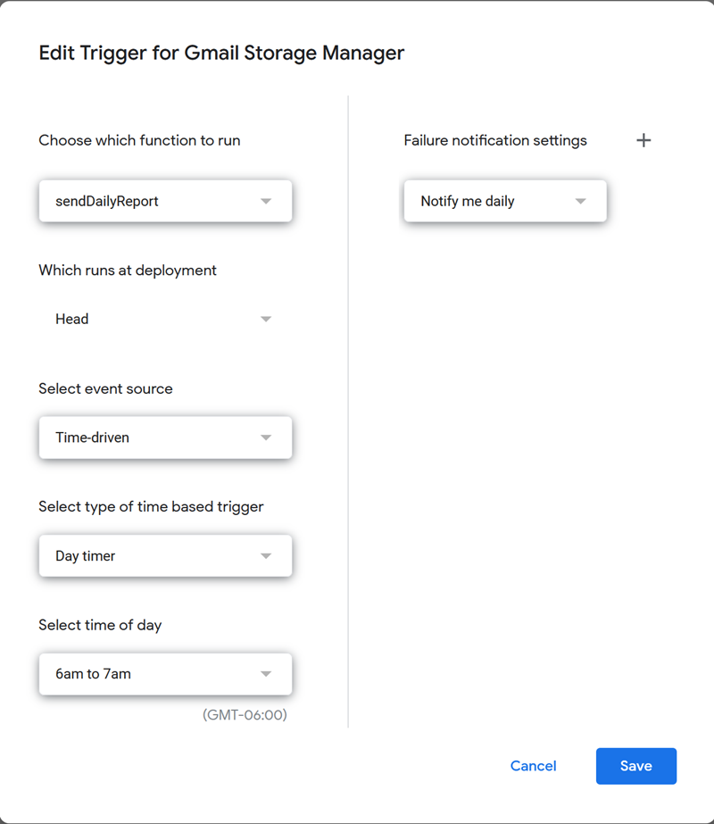

# Gmail Smart Storage Manager

[](https://github.com/smcneece/gmail-cleanup-script/releases)
[](https://github.com/smcneece/gmail-cleanup-script/commits/main)
[](LICENSE)
[](https://github.com/smcneece)

> [](https://github.com/sponsors/smcneece) <-- Why not sponsor me, even a few bucks shows you appreciate the work and gives encouragement. You can sponsor me monthly, or just a one time thing. Check out my [other projects](https://github.com/smcneece?tab=repositories) while you're here.

> ⭐ **Help Others Find This Tool!** If Gmail Smart Storage Manager is saving you from storage headaches, please star this repository to help other users discover this intelligent email cleanup solution!
>
> [](https://github.com/smcneece/gmail-cleanup-script/stargazers) [](https://github.com/smcneece/gmail-cleanup-script/network/members)


> 📬 **Stay Updated:** Click the "Watch" button (top-right of this repo) → "Releases only" to get email notifications when new versions are released!

Born from the frustration of manually managing Gmail sent items and trash folders being filled up with emails from Blue Iris, Home Assistant, and various other systems tied to my Gmail account, **Gmail Smart Storage Manager** uses mathematical precision to automatically clean up your Gmail storage when it gets full. No more guessing, no more manual deletion sprees - just intelligent, calculated cleanup that preserves maximum data while maintaining optimal storage health.


---

## 🧠 How It Works (The Smart Part)

Unlike traditional email cleaners that delete by date or delete fixed amounts, this system uses **mathematical intelligence**:

1. **Counts ALL emails** across your entire Gmail account
2. **Calculates average email size** = Total storage used ÷ Total email count  
3. **Calculates exactly how many emails to delete** = (Current storage - Target storage) ÷ Average email size
4. **Deletes precise number** of oldest emails from your target folder
5. **Achieves storage target in one intelligent run** instead of dozens of guessing attempts

### Real Example from Testing:
- **Problem:** 14% storage used (2.34GB), target 10%
- **Smart calculation:** Need to free 742MB ÷ 0.52MB average = delete exactly 1,418 emails
- **Result:** Deleted 1,418 emails, freed 740MB, achieved 9% storage (99.7% accuracy!)
- **Efficiency:** One 5-minute run vs. 340+ hourly guessing runs (85+ hours saved!)

---

## 🚀 Features

- ✅ **Mathematical precision** - Calculates exact emails to delete, no guessing
- ✅ **Automatic Google storage monitoring** - Uses Drive API for accurate total storage across Gmail + Drive + Photos  
- ✅ **Configurable storage thresholds** - Set your own trigger levels (default: 75%)
- ✅ **Smart target folder selection** - Choose sent items, trash, or any folder
- ✅ **Hourly intelligent monitoring** - Runs only when needed, calculates precise cleanup
- ✅ **Daily email reports** - Detailed storage statistics and cleanup summaries
- ✅ **Evidence preservation mode** - Keeps maximum emails for forensic/security purposes
- ✅ **Batch processing with rate limiting** - Respects Gmail API limits
- ✅ **Comprehensive error handling** - Email notifications for any issues
- ✅ **Zero configuration after setup** - Set it and forget it

---

## 📦 Quick Start

### Prerequisites

1. **Google account** with Gmail (obviously!)
2. **Google Apps Script access** (free with any Google account)

### Installation

1. **Open Google Apps Script**  
   Go to [script.google.com](https://script.google.com)

2. **Create New Project**  
   Click "New project"

3. **Enable Required APIs**
   - In the left sidebar, click "Services" → "+" 
   - Add "**Drive API**"
   - Add "**Gmail API**"

4. **Install the Script**  
   - Delete the default code
   - Copy and paste the complete script from [`gmail_cleanup_script.js`](gmail_cleanup_script.js)
   - **IMPORTANT:** Edit the email addresses in the script (see Configuration section below)
   - Save the project (Ctrl+S)

5. **Configure Your Settings** (see Configuration section below)

6. **Set Up Automated Triggers** (see Automation Setup section below)

---

## ⚙️ Configuration

### Required: Update Email Addresses
**⚠️ IMPORTANT:** Before using the script, you MUST update the email addresses in two places:

```javascript
// In smartCleanupCheck() function:
const REPORT_EMAIL = 'your-email@example.com'; // CHANGE THIS TO YOUR EMAIL

// In sendDailyReport() function:
const REPORT_EMAIL = 'your-email@example.com'; // CHANGE THIS TO YOUR EMAIL
```

### Basic Settings
Edit these values in the script to match your needs:

```javascript
// Storage threshold that triggers cleanup (75% = triggers at 75% full)
const STORAGE_THRESHOLD = 0.75;

// Target folder for email deletion 
const TARGET_FOLDER = 'in:sent';  // Deletes from sent items
// Alternative options:
// 'in:trash'   - Deletes from trash
// 'in:inbox'   - Deletes from inbox  
// 'label:mylabel' - Deletes from custom label
```

### Storage Threshold Examples
- `0.75` = Cleanup when 75% full (recommended for most users)
- `0.85` = Cleanup when 85% full (for users who want maximum storage usage)
- `0.60` = Cleanup when 60% full (for users who want extra safety margin)

### Target Folder Options
- **`'in:sent'`** - Recommended for camera/alert systems (sent items usually disposable)
- **`'in:trash'`** - Good for initial testing or if trash is full of junk
- **`'label:camera-alerts'`** - If you label your camera emails automatically
- **`'from:camera@example.com'`** - Target emails from specific sender

---

## 🤖 Automation Setup

### Set Up Hourly Monitoring
1. In Google Apps Script, click **"Triggers"** (clock icon in sidebar)
2. Click **"+ Add Trigger"**
3. Configure as shown:



   - **Function:** `smartCleanupCheck`
   - **Event source:** Time-driven  
   - **Type:** Hour timer
   - **Every:** 1 hour
4. Click **"Save"**

### Set Up Daily Reports  
1. Click **"+ Add Trigger"** again
2. Configure as shown:



   - **Function:** `sendDailyReport`
   - **Event source:** Time-driven
   - **Type:** Day timer  
   - **Time:** 6am to 7am (or your preference)
3. Click **"Save"**

---

## 📊 Understanding the Reports

### Daily Email Report Example
```
Daily Gmail Storage Report - 73% Used
=====================

Storage Status:
- Used: 12.4 GB of 17 GB
- Free: 4.6 GB  
- Usage: 73%

Email Counts:
- Inbox: 1,250 emails
- Sent: 8,932 emails
- Trash: 156 emails
- Total: 10,338 emails

Cleanup Activity Today:
- Cleanup runs: 1
- Emails deleted: 1,847 emails
- Space freed: ~956 MB

Smart cleanup runs hourly and calculates exact number of emails to delete.
Generated: Fri Aug 22 2025 06:00:23 GMT-0700
```

### Log Output Example
```
Current usage: 12.4GB of 17GB (73%)
Storage under 75% threshold - no cleanup needed
```

Or when cleanup is needed:
```  
Current usage: 13.1GB of 17GB (77%)
Storage over 75% - calculating smart cleanup...
Smart cleanup plan: delete 1,847 emails (956MB) from in:sent
Smart cleanup complete: deleted 1,847 emails
```

---

## 🔧 Advanced Configuration

### Evidence Preservation Mode
Perfect for security camera systems where you want maximum evidence retention:

```javascript
// Conservative cleanup - only goes slightly under threshold  
const STORAGE_THRESHOLD = 0.75;    // Trigger cleanup at 75%
const TARGET_AFTER_CLEANUP = 0.73; // Stop cleanup at 73% (minimal deletion)
```

### Multiple Target Folders
For more complex cleanup strategies, you can modify the script to target multiple folders:

```javascript
// Example: Clean trash first, then sent items if needed
const TARGET_FOLDERS = ['in:trash', 'in:sent'];
```

### Custom Email Size Estimation
If you know your emails are consistently larger/smaller than average:

```javascript
// For camera systems with large image attachments
const MINIMUM_EMAIL_SIZE_MB = 1.0;  // Assume at least 1MB per email

// For text-only emails  
const MAXIMUM_EMAIL_SIZE_MB = 0.1;  // Assume max 100KB per email
```

---

## 🧪 Testing & Validation

### Test Functions
The script includes safe testing functions:

```javascript
// Test email counting (safe - no deletions)
testEmailCount()

// Test daily report (safe - just sends email)  
testDailyReport()

// Test cleanup calculation (safe - shows plan but doesn't delete)
testCleanupCalculation()
```

### Safe Testing Approach
1. **Start with trash folder** for initial testing
2. **Use higher threshold** (like 10%) to trigger cleanup easily
3. **Monitor first few runs** to ensure it works as expected
4. **Switch to production settings** once comfortable

---

## 📈 Performance & Efficiency

### Benchmark Results
Based on real testing with 4,266 emails:

- **Accuracy:** 99.7% (predicted 742MB freed, actual 740MB freed)
- **Speed:** ~280 emails deleted per minute
- **Efficiency:** One intelligent run vs. 340+ guessing runs
- **Time Savings:** 85+ hours of traditional cleanup avoided

### Gmail API Limits
The script respects Gmail API quotas:
- **Batch size:** 100 emails per batch
- **Rate limiting:** 1-second delays between batches  
- **Daily limits:** Well within Google's free tier limits

---

## 🛡️ Security & Safety

### Data Protection
- **No external services** - Runs entirely within Google's infrastructure
- **No data transmission** - Your emails never leave Google's servers
- **Audit trail** - Complete logs of all deletion activity
- **Reversible testing** - Test functions don't delete anything

### Safety Features  
- **Maximum deletion limits** - Won't delete more emails than exist
- **Error email notifications** - Alerts you if anything goes wrong
- **Conservative calculations** - Slight under-targeting to prevent over-deletion
- **Manual override** - Can always run test functions to check before automated runs

### Permissions Required
- **Gmail access** - To count and delete emails
- **Drive API access** - To read accurate storage usage
- **Send email** - To send daily reports

---

## 🤝 Contributing

Found a bug? Have a feature request? Want to improve the mathematical algorithms?

1. **Issues:** Report bugs or request features via GitHub Issues
2. **Pull Requests:** Submit improvements (please test thoroughly!)
3. **Discussions:** Share your use cases and configurations

### Development Setup
1. Fork this repository
2. Set up Google Apps Script development environment
3. Test with non-production Gmail account
4. Submit PRs with detailed testing notes

---

## Use Cases

**Perfect for:**
- Security camera systems (Blue Iris, motion alerts)
- Android device accounts (backup photos, app data)
- Business Gmail accounts with high email volume
- Evidence preservation scenarios (keep maximum data, clean minimally)
- Automated systems that send status emails
- Data retention compliance (keep X amount of storage free)

**Not recommended for:**
- Personal Gmail with important emails you want to manually review
- Legal/compliance scenarios requiring specific retention periods
- Accounts you're not comfortable testing automated deletion on

---

## Troubleshooting

### Common Issues

**Script shows 0% storage used**
- Ensure Drive API is enabled in Services  
- Check script permissions were granted
- Try running `testStorageCheck()` manually

**Emails not deleting**  
- Ensure Gmail API is enabled in Services
- Check target folder has emails matching your criteria
- Verify permissions include Gmail modification

**Daily reports not arriving**
- Check spam folder
- Verify triggers are set up correctly  
- Test with `testDailyReport()` function

**Storage percentage not updating**
- Google storage updates can take 5-15 minutes
- This is normal - script accounts for this delay
- Hourly runs prevent over-deletion

### Getting Help
1. **Check the logs** - Google Apps Script → Executions tab
2. **Test functions** - Use safe test functions to diagnose issues
3. **GitHub Issues** - Report bugs with full error logs
4. **Email reports** - Error details automatically emailed to you

---

## 📄 License

This project is licensed under the MIT License - see the [LICENSE](LICENSE) file for details.

---

## ☕ Support the Project

If this tool saved you time and storage headaches, consider supporting its development!

[](https://github.com/sponsors/smcneece)

**Other ways to help:**
- Star this repository
- Report bugs and issues  
- Share with others who might benefit
- Suggest new features and improvements

---

## Tags

`gmail` `storage-management` `automation` `google-apps-script` `email-cleanup` `home-assistant` `blue-iris` `frigate` `nvr` `security-cameras` `android` `backup` `mathematical-precision` `smart-cleanup`

---

**Gmail Smart Storage Manager**  
*Because storage management should be mathematical, not magical.*

**Intelligent • Precise • Automated**