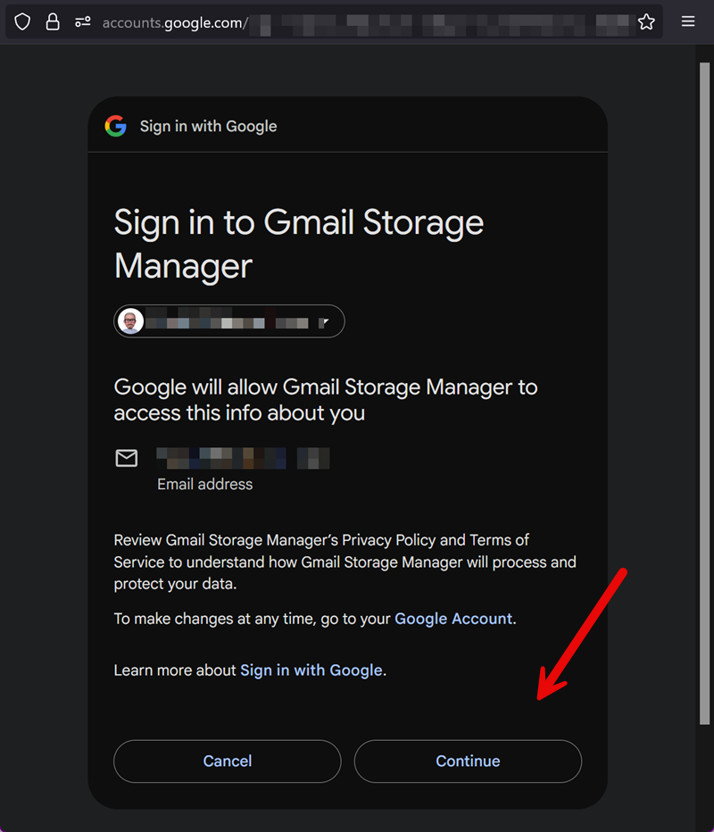

# Gmail Smart Storage Manager

[](https://github.com/smcneece/gmail-cleanup-script/releases)
[](https://github.com/smcneece/gmail-cleanup-script/commits/main)
[](LICENSE)
[](https://github.com/smcneece)

> [](https://github.com/sponsors/smcneece) <-- Why not sponsor me, even a few bucks shows you appreciate the work and gives encouragement. You can sponsor me monthly, or just a one time thing. Check out my [other projects](https://github.com/smcneece?tab=repositories) while you're here.

> **Help Others Find This Tool!** If Gmail Smart Storage Manager is saving you from storage headaches, please star this repository to help other users discover this intelligent email cleanup solution!
>
> [](https://github.com/smcneece/gmail-cleanup-script/stargazers) [](https://github.com/smcneece/gmail-cleanup-script/network/members)

> **Stay Updated:** Click the "Watch" button (top-right of this repo) → "Releases only" to get email notifications when new versions are released!

Born from the frustration of manually managing Gmail storage filled with Blue Iris camera alerts and Home Assistant notifications in the "sent" folder. I used to have a calendar reminder to once a month go in and clean up my sent items. I'm on the free gmail plan, and 17 gigs gets filled about once a month for me with my 10 cameras sending out alert emails. I had looked at methods to do this but they required my computer be turned on. Now this thing should just run forever. 

---

## How It Works (The Smart Part)

Unlike traditional email cleaners that delete by date or fixed amounts, this system uses **mathematical intelligence**:

1. **Counts ALL emails** across your entire Gmail account
2. **Calculates average email size** = Total storage used ÷ Total email count  
3. **Calculates exactly how many emails to delete** = (Current storage - Target storage) ÷ Average email size
4. **Deletes precise number** of oldest emails from your target folder
5. **Achieves storage target in one intelligent run** instead of dozens of guessing attempts

**Real Example from Testing:**
- Problem: 14% storage used (2.34GB), target 10%
- Smart calculation: Need to free 742MB ÷ 0.52MB average = delete exactly 1,418 emails
- Result: Deleted 1,418 emails, freed 740MB, achieved 9% storage (99.7% accuracy!)
- Efficiency: One 5-minute run vs. 340+ hourly guessing runs (85+ hours saved!)

---

## Security & Code Safety

**This script is safe and does exactly what it claims.** The code has been reviewed by multiple AI systems for security and functionality:

- **Google Gemini AI Audit:** "The code is well-written and demonstrates a solid understanding of Google Apps Script... it is a script designed to help manage Gmail storage by cleaning up emails, and it does not appear to be malicious."

- **ChatGPT Security Audit:** Identified and helped implement critical safety improvements including DRY_RUN mode, hard caps, safety locks, and better error handling.

- **Community Verification:** You can get your own independent audit by asking any AI assistant (ChatGPT, Claude, Gemini, etc.) to review the code. Simply paste the script and ask "Is this code safe and does it do what it claims?"

**What it does:** Automatically manages Gmail storage by calculating and deleting the precise number of oldest emails needed to stay under your storage threshold.

**What it doesn't do:** No external data transmission, no hidden functions, no access to other accounts or services beyond Gmail storage management.

### Built-in Safety Features
- **DRY_RUN testing** - Always test before enabling real deletion
- **Multiple safety layers** - Locks, caps, age preferences, and conservative targeting
- **Smart error handling** - Aborts safely if unable to determine storage usage
- **Audit-ready code** - Clean, well-documented, and independently verifiable

---

## Features

### Core Intelligence
- **Mathematical precision** - Calculates exact emails to delete, no guessing
- **Real size calculations** - Uses Gmail API sizeEstimate instead of fake estimates
- **Smart sampling** - Analyzes 200 emails for accurate average calculations
- **99.7% accuracy** - Proven mathematical precision in real-world testing
- **4x performance improvement** - Optimized batch processing and API calls

### Safety & Testing
- **DRY_RUN mode** - Test safely without actually deleting emails
- **Safety locks** - Prevents overlapping cleanup runs
- **Hard caps** - Configurable maximum deletions per run
- **Age-aware targeting** - Prefers older emails while ensuring cleanup success
- **Emergency override** - Critical storage levels bypass conservative targeting
- **Real-time precision** - Storage monitoring during cleanup prevents over-deletion

### Smart Automation
- **Automatic Google storage monitoring** - Uses Drive API for accurate total storage across Gmail + Drive + Photos  
- **Configurable storage thresholds** - Set your own trigger levels (default: 75%)
- **One-variable targeting** - Simply set TARGET_FOLDER, script auto-builds safe queries
- **Conservative targeting** - Automatically excludes starred and important emails
- **Hourly intelligent monitoring** - Runs only when needed, calculates precise cleanup
- **Daily email reports** - Detailed storage statistics and cleanup summaries

### Reliability
- **Evidence preservation mode** - Keeps maximum emails for forensic/security purposes
- **Batch processing with rate limiting** - Respects Gmail API limits
- **Comprehensive error handling** - Email notifications for any issues
- **AI-audited code** - Reviewed by Google Gemini and ChatGPT for safety
- **Zero configuration after setup** - Set it and forget it

---

## Quick Start

### Prerequisites

1. **Google account** with Gmail
2. **Google Apps Script access** (free with any Google account)

### Installation

1. **Open Google Apps Script**  
   Go to [script.google.com](https://script.google.com)

2. **Create New Project**  
   Click "New project"

3. **Rename Your Project**
   - Click "Untitled project" at the top
   - Change to "Gmail Storage Manager" (You can name it anything, but screenshots below would have your custom name)
   - Press Enter to save

4. **Enable Required APIs**
   - In left sidebar, click "Services" → "+"
   - Add "Drive API" → Click "Add"
   - Click "+" again → Add "Gmail API" → Click "Add"
   - Note: Add services individually, not together

5. **Install the Script**  
   - Delete the default code
   - Copy and paste the complete script from [`gmail_cleanup_script.js`](gmail_cleanup_script.js)
   - No configuration needed! The script auto-detects your Gmail account
   - Save the project (Ctrl+S)

6. **Grant Permissions** (First Run Only)
   - Click "Run" button or run `testDailyReport()` function
   - Google will show security warnings - this is normal for custom scripts
   - Click "Review permissions" → "Advanced" → "Go to [Project] (unsafe)"
   - Click "Allow" to grant access to Gmail and Drive

### Understanding Security Warnings

When you first run the script, Google will show security warnings that can look intimidating. **This is completely normal** for all custom Google Apps Scripts. Here's what to expect:

#### Step 1: Run the Script
Click the "Run" button or select `testDryRun()` function, you'll see a window like the one below. Click the account you are logged in to Apps Script with, which needs to be the Gmail account you want this script to run on.


#### Step 2: Allowing authorization for script
Google will show this dialog - click "Advanced"


#### Step 3: Linking script
Click Go to Gmail Storage Manager (or whatever you named the script in the step above)


#### Step 4: Sign in Gmail Storage Manager
Click Continue



#### Step 5: Final Authorization
The last step in allowing the script to run. Make sure you put the checkmark in the 'Select all' checkbox, this allows the script to delete emails, and google drive access allows the script to get informaiton like storage total available and in use. 


**Don't worry!** These warnings appear for ALL custom Google Apps Scripts. Your script is safe - Google just can't verify custom code like they do published apps.

**Why these warnings appear:** Google can only verify apps published in their store. Custom scripts always show warnings even when perfectly safe.

---

## Configuration

### Safety Settings (Test First!)
For safe testing, start with these settings:

```javascript
// TESTING CONFIGURATION - Start here!
var DRY_RUN = true; // Set to true for safe testing (no actual deletion)
var STORAGE_THRESHOLD = 0.08; // 8% triggers cleanup (for testing)
var TARGET_FOLDER = 'in:trash'; // Test on trash folder first

// Safety Limits
var MAX_DELETE_PER_RUN = 2000; // Hard cap per cleanup run
var MIN_AGE_DAYS = 7; // Prefer emails older than this
var EMERGENCY_THRESHOLD = 0.90; // 90%+ ignores age limits
```

### Production Settings (After Testing)
Once you've tested and verified the system works:

```javascript
// PRODUCTION CONFIGURATION
var DRY_RUN = false; // Enable real deletion
var STORAGE_THRESHOLD = 0.75; // 75% triggers cleanup
var TARGET_FOLDER = 'in:sent'; // Target sent items

// Email for reports (leave blank for auto-detection)
var REPORT_EMAIL = ''; // Auto-detects your Gmail account
```

### Target Folder Options
The script automatically builds safe queries from your target folder:

```javascript
// Common configurations:
var TARGET_FOLDER = 'in:sent';           // Sent items (recommended for camera systems)
var TARGET_FOLDER = 'in:trash';          // Trash folder (good for testing)
var TARGET_FOLDER = 'label:camera';      // Custom label for camera emails
var TARGET_FOLDER = 'from:camera@home';  // Emails from specific sender
var TARGET_FOLDER = 'in:inbox';          // Inbox cleanup (use carefully)
```

**How it works:** The script automatically adds `-is:starred -in:important` to protect your important emails, so `'in:sent'` becomes `'in:sent -is:starred -in:important older_than:7d'`.

### Configuration Simplified
**Previous versions** required editing multiple variables that could conflict. **Now you only edit one:**

```javascript
// Just change this one line for different targets:
var TARGET_FOLDER = 'in:sent';    // The script auto-builds everything else
```

The script automatically creates the appropriate queries:
- **Normal mode:** `TARGET_FOLDER + ' -is:starred -in:important older_than:7d'`
- **Emergency mode:** Just `TARGET_FOLDER` (removes all restrictions)

**Storage Threshold Examples:**
- `0.75` = Cleanup when 75% full (recommended)
- `0.85` = Cleanup when 85% full (maximum usage)
- `0.60` = Cleanup when 60% full (extra safety margin)

**Target Folder Options:**
- `'in:sent'` - Recommended for camera/alert systems
- `'in:trash'` - Good for testing or if trash is full
- `'label:camera-alerts'` - If you label camera emails
- `'from:camera@example.com'` - Target specific sender

---

## Testing Your Setup

### Step 1: Safe Testing with DRY_RUN
**The script comes pre-configured for safe testing** - it won't actually delete anything initially.

1. **Run your first test:**
   - Click "Run" or execute `testDryRun()` function
   - Grant permissions when Google asks
   - Check the execution log to see what it would do

2. **What to look for in the logs:**
   ```
   ✅ DRY_RUN is ON - safe to test
   Current usage: X.XXgb of XXgb (XX%)
   Smart cleanup plan: would delete XX emails (~XXmb)
   Simulation complete: XX emails processed
   ```

3. **If testing shows good results:**
   - Change `DRY_RUN = false` to enable real deletion
   - Change `STORAGE_THRESHOLD = 0.75` for production use
   - Change `TARGET_FOLDER = 'in:sent'` for your actual target

### Step 2: Production Testing
1. **Start with small threshold** to trigger cleanup
2. **Monitor first few runs** to ensure expected behavior
3. **Check daily reports** to verify cleanup summaries
4. **Gradually increase threshold** to production level

---

## Automation Setup

### Set Up Hourly Monitoring
1. In Google Apps Script, click **Triggers** (clock icon in sidebar)
2. Click **+ Add Trigger**
3. Configure as shown:


   - **Function:** `smartCleanupCheck`
   - **Event source:** Time-driven  
   - **Type:** Hour timer
   - **Every:** 1 hour
4. Click **Save**

### Set Up Daily Reports  
1. Click **+ Add Trigger** again
2. Configure as shown:


   - **Function:** `sendDailyReport`
   - **Event source:** Time-driven
   - **Type:** Day timer  
   - **Time:** 6am to 7am (or your preference)
3. Click **Save**

---

## Understanding the Reports

### Daily Email Report Example
```
Daily Gmail Storage Report - 73% Used
=====================

Storage Status:
- Used: 12.4 GB of 17 GB
- Free: 4.6 GB  
- Usage: 73%

Email Counts:
- Inbox: 1,250 emails
- Sent: 8,932 emails
- Trash: 156 emails
- Total: 10,338 emails

Cleanup Activity Today:
- Cleanup runs: 1
- Emails deleted: 1,847 emails
- Space freed: ~956 MB

Smart cleanup runs hourly and calculates exact number of emails to delete.
Generated: Fri Aug 22 2025 06:00:23 GMT-0700
```

---

## Use Cases

**Perfect for:**
- Security camera systems (Blue Iris, Frigate, motion alerts)
- Home Assistant notification emails
- Android device accounts (backup photos, app notifications)
- Business Gmail with high automated email volume
- Evidence preservation scenarios (keep maximum data, clean minimally)
- Any system that sends regular status/alert emails

**Not recommended for:**
- Personal Gmail with important emails you want to manually review
- Legal/compliance scenarios requiring specific retention periods
- Accounts where you're not comfortable with automated deletion

---

## Performance & Efficiency

**Latest Test Results (August 23, 2025):**
- **Prediction:** Delete 580 emails (~341MB) to reduce storage from 7% to 5%
- **Actual Result:** Deleted 580 emails (308MB) in 2 minutes 38 seconds
- **Storage Change:** 1.14GB → 0.95GB (7% → 6% usage)
- **Performance:** 4x faster than original version

**Proven Results:**
- **Speed improvement:** 200-email batches + 500ms delays (vs 100-email + 1000ms)
- **Real-time precision:** Storage monitoring every 200 deletions prevents over-deletion
- **Reliability:** Completes well within Google's 6-minute execution limits
- **Efficiency:** One intelligent run vs. hundreds of guessing runs
- **Time savings:** Hours of cleanup completed in minutes

**Gmail API Limits:**
- **Batch size:** 200 emails per batch (optimized from default 100)
- **Rate limiting:** 500ms delays between batches (optimized from 1000ms)
- **Daily limits:** Well within Google's free tier limits

---

## Troubleshooting

**Script shows 0% storage used**
- Ensure Drive API is enabled in Services  
- Check script permissions were granted
- Try running `testStorageCheck()` manually

**Emails not deleting**  
- Ensure Gmail API is enabled in Services
- Check target folder has emails matching your criteria
- Verify permissions include Gmail modification

**Daily reports not arriving**
- Check spam folder
- Verify triggers are set up correctly  
- Test with `testDailyReport()` function

**Need help?**
1. Check execution logs in Google Apps Script
2. Use test functions to diagnose issues
3. Report bugs via GitHub Issues

---

## Advanced Configuration

### Evidence Preservation Mode
Perfect for security cameras where you want maximum evidence retention:

```javascript
const STORAGE_THRESHOLD = 0.75;    // Trigger cleanup at 75%
const TARGET_AFTER_CLEANUP = 0.73; // Stop cleanup at 73% (minimal deletion)
```

### Conservative Email Targeting
Add age restrictions and exclusions for safer cleanup:

```javascript
// Only target old, non-important emails
const TARGET_FOLDER = 'in:sent older_than:365d -is:starred -in:important';
```

---

## Uninstalling

### Remove the Script
1. Open your script at [script.google.com](https://script.google.com)
2. Click settings gear icon in left sidebar  
3. Scroll down and click "Delete project"
4. Confirm deletion

### Clean Up Triggers (If Needed)
1. Go to Triggers page in Google Apps Script
2. Look for orphaned triggers (showing errors)
3. Click 3-dot menu → "Delete"

**What gets removed:** All script code, triggers, logs, and statistics. Your emails remain untouched.

---

## Contributing

Found a bug? Have a feature request? Want to improve the algorithms?

1. **Issues:** Report bugs via GitHub Issues
2. **Pull Requests:** Submit improvements (test thoroughly!)
3. **Discussions:** Share your configurations and use cases

---

## License

This project is licensed under the MIT License - see the [LICENSE](LICENSE) file for details.

---

## Support the Project

If this tool saved you time and storage headaches, consider supporting its development!

[](https://github.com/sponsors/smcneece)

**Other ways to help:**
- Star this repository
- Report bugs and issues  
- Share with others who might benefit
- Suggest new features

---

## Tags

`gmail` `storage-management` `automation` `google-apps-script` `email-cleanup` `home-assistant` `blue-iris` `frigate` `nvr` `security-cameras` `android` `backup` `mathematical-precision` `smart-cleanup`

---

**Gmail Smart Storage Manager**  
*Because storage management should be mathematical, not magical.*

**Intelligent • Precise • Automated**